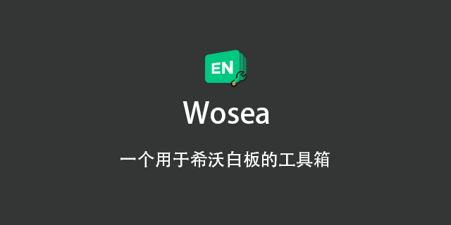

<h2 align="center">WoSea</h2>
<p align="center">


<p/>


**Wosea**是一个希沃白板的工具箱,主要还是用于整活以及便于老师上课使用.

## 目录
- 安装
  - 更新
- 使用
  - 添加功能
- 展望
- 贡献
- 致谢
- 许可证

### 安装
此项目依赖于[Python](https://www.python.org),如果你尚未安装Python,请前往安装.

首先,下载此仓库至你的设备:
```sh
git clone https://github.com/Jaffrez/Wosea.git
# 安装依赖
python -m pip install -r requirements.txt
# 启动软件
pythonw main.py
```
### 更新
此项目自带更新模块,但是你应当保证网络畅通以连接github进行更新.<br/>
当然,你也可以自建更新服务器,具体可以参照[docs](docs/update_server/README.md)操作.
### 使用
TODO:
### 添加功能
TODO:
### 展望
TODO:
### 贡献
欢迎对此项目进行贡献!你可以打开一个[issue](https://github.com/Jaffrez/Wosea/issues)或者提交PRs.
### 致谢
本项目由[Jaffrez](https://github.com/jaffrez/)和[Bliod-Cook](https://github.com/Bliod-Cook/)开发.十分感谢你们的付出.
### 许可证
此项目在[MIT](LICENSE)协议下开源.